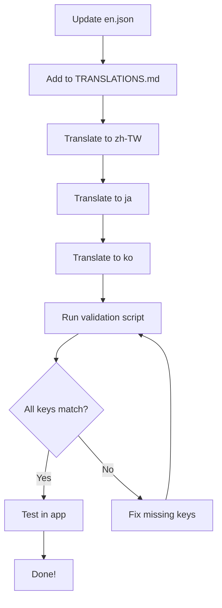

# Content Update Guide

This guide explains how to update content in the WWM Helper App while maintaining translations across all 4 languages.

---

## 📋 Table of Contents

1. [Quick Reference](#quick-reference)
2. [Adding New Images](#adding-new-images)
3. [Adding New Sections](#adding-new-sections)
4. [Updating Existing Text](#updating-existing-text)
5. [Translation Workflow](#translation-workflow)
6. [Validation and Testing](#validation-and-testing)
7. [Common Scenarios](#common-scenarios)

---

## Quick Reference

### Supported Languages
- 🇬🇧 English (en) - Base language
- 🇹🇼 Traditional Chinese (zh-TW)
- 🇯🇵 Japanese (ja)
- 🇰🇷 Korean (ko)

### Key Files
- Translation files: `src/locales/*.json`
- Validation script: `scripts/checkTranslations.js`
- Translation changelog: `TRANSLATIONS.md`

### Commands
```bash
# Check translation sync
node scripts/checkTranslations.js

# Start dev server
npm start
```

---

## 🖼️ Adding New Images

### Step 1: Add Image to Assets

Place your image in the appropriate directory:

```
assets/
├── bosses-campaign/     # Campaign boss images
├── bosses-world/        # World boss images
├── martial_art_weapons/ # Weapon images
├── menu_buttons/        # UI button icons
└── [root]               # General images (banners, logos, etc.)
```

**✅ IMPORTANT**: Images are language-agnostic! One image works for all 4 languages.

### Step 2: Reference in Code

```typescript
// Example: Adding a new event banner
<Image
  source={require('../../assets/new-event-banner.png')}
  style={styles.bannerImage}
  resizeMode="cover"
/>
```

**That's it!** The image automatically displays in all language versions.

### Example: Adding New Boss Image

```typescript
// 1. Add image: assets/bosses-world/new_boss.png

// 2. Reference in boss data:
{
  id: 'new-boss',
  name: t('bosses.newBoss.name'),  // Translatable text
  image: require('../../assets/bosses-world/new_boss.png')  // Single image
}
```

---

## ➕ Adding New Sections

### Step 1: Plan Your Content

Identify what needs translation:
- Section titles
- Descriptions
- Button labels
- Error messages
- Dynamic content

### Step 2: Add Translation Keys

**English (`src/locales/en.json`):**
```json
{
  "newFeature": {
    "title": "New Feature",
    "description": "Feature description here",
    "buttonLabel": "Try It Now",
    "emptyState": "No items found"
  }
}
```

### Step 3: Translate to All Languages

**Traditional Chinese (`zh-TW.json`):**
```json
{
  "newFeature": {
    "title": "新功能",
    "description": "功能描述",
    "buttonLabel": "立即嘗試",
    "emptyState": "找不到項目"
  }
}
```

**Japanese (`ja.json`):**
```json
{
  "newFeature": {
    "title": "新機能",
    "description": "機能の説明",
    "buttonLabel": "今すぐ試す",
    "emptyState": "アイテムが見つかりません"
  }
}
```

**Korean (`ko.json`):**
```json
{
  "newFeature": {
    "title": "새로운 기능",
    "description": "기능 설명",
    "buttonLabel": "지금 시도",
    "emptyState": "항목을 찾을 수 없습니다"
  }
}
```

### Step 4: Create the Component

```typescript
import React from 'react';
import { View, Text, TouchableOpacity } from 'react-native';
import { useTranslation } from 'react-i18next';

export default function NewFeatureScreen() {
  const { t } = useTranslation();

  return (
    <View>
      <Text>{t('newFeature.title')}</Text>
      <Text>{t('newFeature.description')}</Text>
      <TouchableOpacity>
        <Text>{t('newFeature.buttonLabel')}</Text>
      </TouchableOpacity>
    </View>
  );
}
```

### Step 5: Add Navigation

```typescript
// In BottomTabNavigator.tsx or appropriate navigator
<Tab.Screen
  name="NewFeature"
  component={NewFeatureScreen}
  options={{
    title: t('tabs.newFeature'),
    tabBarLabel: t('tabs.newFeature'),
  }}
/>
```

### Step 6: Validate

```bash
node scripts/checkTranslations.js
```

---

## ✏️ Updating Existing Text

### Scenario: Event Date Changed

**Step 1: Update English**

```json
// src/locales/en.json
"twitchDrops": {
  "dateRange": "Dec 1 - Dec 15, 2025"  // Changed from "Nov 14 - Dec 1, 2025"
}
```

**Step 2: Update Other Languages**

```json
// src/locales/zh-TW.json
"twitchDrops": {
  "dateRange": "2025年12月1日 - 12月15日"
}

// src/locales/ja.json
"twitchDrops": {
  "dateRange": "2025年12月1日 - 12月15日"
}

// src/locales/ko.json
"twitchDrops": {
  "dateRange": "2025년 12월 1일 - 12월 15일"
}
```

**Step 3: Document Change**

Add to `TRANSLATIONS.md`:
```markdown
### Update 2025-12-01
- Changed `home.twitchDrops.dateRange` to reflect new event dates
- Updated in all 4 languages
```

**Step 4: Validate**

```bash
node scripts/checkTranslations.js
```

---

## 🔄 Translation Workflow

### For Major Updates



### For Minor Updates (1-5 keys)

1. Update `en.json`
2. Translate to other 3 languages immediately
3. Run `node scripts/checkTranslations.js`
4. Test in app

### For Quarterly Updates

1. Gather all English content updates
2. Create a translation batch in `TRANSLATIONS.md`
3. Translate all content for one language at a time
4. Validate after each language
5. Test comprehensively before release

---

## ✅ Validation and Testing

### Automated Validation

```bash
# Check all keys are present in all languages
node scripts/checkTranslations.js
```

**Output:**
```
✓ Loaded en.json
✓ Loaded zh-TW.json
✓ Loaded ja.json
✓ Loaded ko.json

Base language (English): 160 keys

Checking zh-TW.json (160 keys):
  ✓ No missing keys
  ✓ No extra keys

✓ All translation files are in sync!
```

### Manual Testing Checklist

- [ ] Test app in English
- [ ] Switch to Traditional Chinese and verify
- [ ] Switch to Japanese and verify
- [ ] Switch to Korean and verify
- [ ] Check all new/updated screens
- [ ] Verify text fits in UI (no overflow)
- [ ] Test dynamic content (plurals, variables)
- [ ] Verify images display correctly

### Testing Language Switching

1. Open app
2. Go to More → Language
3. Select each language
4. Navigate through all screens
5. Verify translations are correct and complete

---

## 📖 Common Scenarios

### Scenario 1: Adding a News Article

**Goal**: Add new event news to Home screen

```typescript
// 1. Add keys to all language files
{
  "home": {
    "winterEvent": {
      "title": "Winter Festival Event",
      "dateRange": "Dec 20 - Jan 10",
      "description": "Celebrate the season with exclusive rewards..."
    }
  }
}

// 2. Update Home.tsx
<View style={styles.newsCard}>
  <Text style={styles.newsTitle}>{t('home.winterEvent.title')}</Text>
  <Text style={styles.newsDate}>{t('home.winterEvent.dateRange')}</Text>
  <Text style={styles.paragraph}>{t('home.winterEvent.description')}</Text>
</View>

// 3. Add event banner image
<Image source={require('../../assets/winter-event.png')} />
```

### Scenario 2: Adding a New Weapon

**Goal**: Add new weapon to database

```typescript
// 1. Add weapon data (src/data/weapons/weaponDatabase.ts)
{
  id: 'sword-frost',
  name: 'Frost Blade',              // Keep in English in data
  type: 'Sword',
  description: 'A legendary blade...', // Keep in English in data
  // ... other properties
}

// 2. Future: Create translation keys for weapon data
// (This is planned for a future update)
```

### Scenario 3: Updating Error Messages

**Goal**: Improve error message clarity

```json
// Before
"common": {
  "error": "Something went wrong"
}

// After - more specific
"common": {
  "error": "Something went wrong",
  "networkError": "Unable to connect. Please check your internet connection.",
  "dataLoadError": "Failed to load data. Please try again."
}
```

Then translate to all languages and use in components:

```typescript
{isNetworkError && <Text>{t('common.networkError')}</Text>}
{isDataLoadError && <Text>{t('common.dataLoadError')}</Text>}
```

---

## 🎯 Best Practices

### ✅ DO:
- Always update English first
- Translate to all 3 other languages immediately
- Run validation script before committing
- Document changes in TRANSLATIONS.md
- Test in all languages
- Use semantic key names
- Group related keys under sections

### ❌ DON'T:
- Hard-code text in components
- Create language-specific image files (use one image for all)
- Skip validation after changes
- Forget to update TRANSLATIONS.md
- Leave translations incomplete
- Use cryptic key names
- Nest keys too deeply (3 levels max recommended)

---

## 🆘 Troubleshooting

### Problem: Translation key not found

**Error**: `Missing translation key: "home.newKey"`

**Solution**:
1. Check if key exists in `en.json`
2. Verify key name is correct (case-sensitive)
3. Run `node scripts/checkTranslations.js`
4. Restart development server

### Problem: Text overflows in UI

**Solution**:
1. Shorten translation if possible
2. Adjust component styles (e.g., `numberOfLines` prop)
3. Use abbreviations for space-constrained areas
4. Test on different screen sizes

### Problem: Validation script fails

**Error**: `Some languages are missing keys`

**Solution**:
1. Run `node scripts/checkTranslations.js` to see which keys are missing
2. Add missing keys to the respective language files
3. Re-run validation

---

## 📞 Getting Help

- Review this guide thoroughly
- Check `TRANSLATIONS.md` for recent changes
- Run validation script for automated checks
- Test changes in all 4 languages before finalizing

---

**Last Updated**: 2025-11-20
**Version**: 1.0.0
